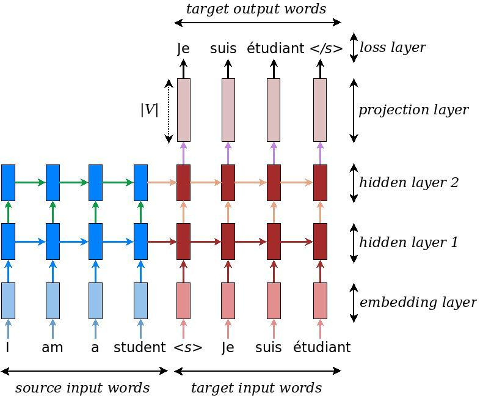

# Neural Machine Translation (seq2seq) Tutorial

- [Introduction](#introduction)


# Introduction
Sequence-to-sequence (seq2seq) models
([Sutskever et al., 2014](https://papers.nips.cc/paper/5346-sequence-to-sequence-learning-with-neural-networks.pdf),
[Cho et al., 2014](http://emnlp2014.org/papers/pdf/EMNLP2014179.pdf)) have enjoyed great success in a variety of tasks such as machine translation, speech recognition, and text summarization. This tutorial gives readers a full understanding of seq2seq models and shows how to build a competitive seq2seq model from scratch. We focus on the task of Neural Machine Translation (NMT) which was the very first testbed for seq2seq models with wild [success](https://research.googleblog.com/2016/09/a-neural-network-for-machine.html). The included code is lightweight,hig-equality,production-ready,and incorporated with the latest research ideas. We achieve this goal by:

1. Using the recent decoder/attention wrapper [API](https://github.com/tensorflow/tensorflow/tree/master/tensorflow/contrib/seq2seq/python/ops), Tensorflow 1.2 data iterator
1. Incorporating our strong expertise in building recurrent and seq2seq models
1. Providing tips and tricks for building the very best NMT models and replicating [Google's NMT(GNMT) System](https://research.google.com/pubs/pub45610.html).

We believe that it is important to provide benchmarks that people can easily replicate. As a rsult, we have provided full experimental results and pretrained on models the folling publicly available datasets:
1. *Small-scale*: english-vietnamese parallel corpus of TED talks (113k Sentence pairs) provided by the [IWSLT Evaluation Campaign](https://sites.google.com/site/iwsltevaluation2015/).
1. *Large-scale*: German-English parallel corpus (4.5M sentence pairs) provided
   by the [WMT Evaluation Campaign](http://www.statmt.org/wmt16/translation-task.html).

We first build up some basic knowledge about seq2seq models for NMT,explaining how to build and train a vanilla NMT . The second part will  go into details of building a competitive NMT model attention mechanism. We then discuss tips and tricks to build the best possible NMT models(both in speed and translation quality) such as Tensorflow best practices (batching, bucketing), bidirectional RNNs, beam search, as well as scaling up to multiple GPUS using GNMT attention.


# Basic

## Background on Neural Machine Translation
Back in the old days, traditional phease-based translation systems performed their task by breaking up source sentences into multiple chunks and then translate them phrase-by-phrase.This led to disfluency in the translation outputs and was no quite like how we, humans,translate. We read the entire source sentence,understand it meaning, and then produce a translation. Neural Machine Translation(NMT) mimics that!

<p align="center">

<br>
Figure 1. <b>Encoder-decoder architecture</b> – example of a general approach for
NMT. An encoder converts a source sentence into a "meaning" vector which is
passed through a <i>decoder</i> to produce a translation.
</p>

Specifically, an NMT system first reads the source sentence using an *encoder* to build a "thought" vector,a sequence of numbers that represents the sentence meaning; a decoder, then, processes the sentence vector to emit a translation, as illustrated in Figure 1. This is often referred to as the encoder-decoder architecture. In this manner,NMT addresses the local translation problem tn the traditional phrase-based approach; it can capture long-range dependencies in languages, e.g., gender agreements; syntax structures; etc, and produce much more fluent translations as demonstrated by [Google Neural Machine Translation systems](Google Neural Machine Translation systems](https://research.googleblog.com/2016/09/a-neural-network-for-machine.html).

NMT models vary in terms of their exact architectures, A natural choice for sequence data is the recurrent neural network(RNN),used by most NMt models,Usually is used for both the encoder and decoder. The RNN models, however,differ in terms of; (a) *directionality*-unidirectional or bidirectional; (b) depth-single-or multi-layer; and (c) *type* -often either a vanilla RNN,a Long Short-term Memory (LSTM),or gated recurrent unit(GRU).Interested readers can find more information about RNNS and LSTM on this [blog post]((http://colah.github.io/posts/2015-08-Understanding-LSTMs/)

In this tutorial ,we consider as examples a deep *multi-layer RNN* which is unidirectional and uses LSTM as a recurrent unit. We show an example of such a model in figure 2. In this example ,we build a model to translat a source sentence "I am a student" into a target sentence "Je suis étudiant". As a hige level, the NMT consists of two recurrent neural networks: the encoder RNN simply consumes the input source words without marking ant prediction;the decoder, on the other hand, process the target sentence while predicting the nets words.

For more information, we refer readers to [Luong (2016)](https://github.com/lmthang/thesis) which this tutorial is based on.

<p align="center">

<br>
Figure 2. <b>Neural machine translation</b> – example of a deep recurrent
architecture proposed by for translating a source sentence "I am a student" into
a target sentence "Je suis étudiant". Here, "&lts&gt" marks the start of the
decoding process while "&lt/s&gt" tells the decoder to stop.
</p>


## Installing the Tutorial

To install this tutorial, you need to have TensorFlow installed on your system.
This tutorial requires TensorFlow Nightly. To install TensorFlow, follow
the [installation instructions here](https://www.tensorflow.org/install/).

Once TensorFlow is installed, you can download the source code of this tutorial
by running:

``` shell
git clone https://github.com/tensorflow/nmt/
```

## Training – How to build our first NMT system

Let's first dive into the heart of building an NMT model with concrete code
snippets through which we will explain Figure 2 in more detail. We defer data
preparation and the full code to later. This part refers to
file
[**model.py**](nmt/model.py).

At the bottom layer, the encoder and decoder RNNs receive as input the
following: first, the source sentence, then a boundary marker "\<s\>" which
indicates the transition from the encoding to the decoding mode, and the target
sentence.  For *training*, we will feed the system with the following tensors,
which are in time-major format and contain word indices:

-  **encoder_inputs** [max_encoder_time, batch_size]: source input words.
-  **decoder_inputs** [max_decoder_time, batch_size]: target input words.
-  **decoder_outputs** [max_decoder_time, batch_size]: target output words,
   these are decoder_inputs shifted to the left by one time step with an
   end-of-sentence tag appended on the right.

Here for efficiency, we train with multiple sentences (batch_size) at
once. Testing is slightly different, so we will discuss it later.

### Embedding
Given the categorical nature of words, the model must first loo up the source and target embeddings to retrieve the corresponding word representations. For this *embedding layer* to work, a vocabulary is first chosen for each language. Usually, a vocabulary size V is selected , and only the most frequent V words are treated as unique. All other words are converted to an "unknown" token and all get the same embedding. The embedding weights, one set per language, are usually learned during training.

``` python
# Embedding
embedding_encoder = variable_scope.get_variable(
    "embedding_encoder", [src_vocab_size, embedding_size], ...)
# Look up embedding:
#   encoder_inputs: [max_time, batch_size]
#   encoder_emb_inp: [max_time, batch_size, embedding_size]
encoder_emb_inp = embedding_ops.embedding_lookup(
    embedding_encoder, encoder_inputs)
```

Similarity,we can build *embedding_decoder* and *decoder_emb_inp*.Note that one can choose to initialize embedding weights with pretrained word representations such as word2vec or Glove vectors. In general,given a large amount of training data we can learn these embeddings from scratch.

### Encoder
Once retrieved, the word embeddings are then fed as input into the main network,which consists of two multi-layer RNNs - an encoder for the source language and a decoder for the target language. These two RNNs, in principle,can share the same weights; however, in practice,we ofter use two different RNN parameters (such models do a better job when fitting large training datasets). The *encoder* RNN uses zero vectors as its starting states and is build as follows:
``` python
# Build RNN cell
encoder_cell = tf.nn.rnn_cell.BasicLSTMCell(num_units)

# Run Dynamic RNN
#   encoder_outpus: [max_time, batch_size, num_units]
#   encoder_state: [batch_size, num_units]
encoder_outputs, encoder_state = tf.nn.dynamic_rnn(
    encoder_cell, encoder_emb_inp,
    sequence_length=source_sequence_length, time_major=True)
```
Note that sentence have different langhts to avoid wasting computation, we tell *dynamic_rnn* the exact source sentence lengths through *source_sequence_length*.
Since our input is time major, we set *time_major=True*.Here,we build only a single layer LSTM, *encoder_cell*.We will describe how to build multi-layer LSTMs, add dropout, and use attention in aa later section.

### Decoder

The *decoder* also needs to have access to the source information, and one
simple way to achieve that is to initialize it with the last hidden state of the
encoder, *encoder_state*. In Figure 2, we pass the hidden state at the source
word "student" to the decoder side.

``` python
# Build RNN cell
decoder_cell = tf.nn.rnn_cell.BasicLSTMCell(num_units)
```

``` python
# Helper
helper = tf.contrib.seq2seq.TrainingHelper(
    decoder_emb_inp, decoder_lengths, time_major=True)
# Decoder
decoder = tf.contrib.seq2seq.BasicDecoder(
    decoder_cell, helper, encoder_state,
    output_layer=projection_layer)
# Dynamic decoding
outputs, _ = tf.contrib.seq2seq.dynamic_decode(decoder, ...)
logits = outputs.rnn_output
```

Here, the core part of this code is the *BasicDecoder* object, *decoder*, which
receives *decoder_cell* (similar to encoder_cell), a *helper*, and the previous
*encoder_state* as inputs. By separating out decoders and helpers, we can reuse
different codebases, e.g., *TrainingHelper* can be substituted with
*GreedyEmbeddingHelper* to do greedy decoding. See more in [helper.py](https://github.com/tensorflow/tensorflow/blob/master/tensorflow/contrib/seq2seq/python/ops/helper.py).

Lastly, we haven't mentioned *projection_layer* which is a dense matrix to turn
the top hidden states to logit vectors of dimension V. We illustrate this
process at the top of Figure 2.
``` python
projection_layer = layers_core.Dense(
    tgt_vocab_size, use_bias=False)
```


### Loss

Given the *logits* above, we are now ready to compute our training loss:

``` python
crossent = tf.nn.sparse_softmax_cross_entropy_with_logits(
    labels=decoder_outputs, logits=logits)
# 平均batch的loss (交叉熵*权重)/总的batch_size
train_loss = (tf.reduce_sum(crossent * target_weights) /
    batch_size)
```

Here, *target_weights* is a zero-one matrix of the same size as
*decoder_outputs*. It masks padding positions outside of the target sequence
lengths with values 0.


***Important note***: It's worth pointing out that we divide the loss by
*batch_size*, so our hyperparameters are "invariant" to batch_size. Some people
divide the loss by (*batch_size* * *num_time_steps*), which plays down the
errors made on short sentences. More subtly, our hyperparameters (applied to the
former way) can't be used for the latter way. For example, if both approaches
use SGD with a learning of 1.0, the latter approach effectively uses a much
smaller learning rate of 1 / *num_time_steps*.

### Gradient computation & optimization
We have now defined the forward pass of our NMT model. Computing the
backpropagation pass is just a matter of a few lines of code:

``` python
# Calculate and clip gradients
params = tf.trainable_variables()
# trainable_variables() 确实是params
# 下面的这个方法又是怎么确定的
gradients = tf.gradients(train_loss, params)
clipped_gradients, _ = tf.clip_by_global_norm(
    gradients, max_gradient_norm)
```
One of the important steps in training RNNs is gradient clipping.Here,we clip by the global norm.The max value,
max_gradient_norm, is often set to a value like 5 or 1. The last step is selecting the optimizer. The Adam is a common  
choice. We also select a learning rate.The value of learning_rate can is usually in he range 0.00001 to 0.001;and can 
be set to decrease as training progresses.

``` python
# Optimization
optimizer = tf.train.AdamOptimizer(learning_rate)
update_step = optimizer.apply_gradients(
    zip(clipped_gradients, params))
```
In our own experiments, we use standard SGD (tf.train.GradientDescentOptimizer)
with a decreasing learning rate schedule, which yields better performance. See
the [benchmarks](#benchmarks).


## Hands-on – Let's train an NMT model
Let's train our very first NMT model, translating from Vietnamese to English! The entry point of our code
is [**nmt.py**](nmt/nmt.py).

We will use a *small-scale parallel corpus of TED talks* (133K training examples) for this exercise. All data we used here can be found
at: [https://nlp.stanford.edu/projects/nmt/](https://nlp.stanford.edu/projects/nmt/). We will use tst2012 as our dev dataset, and tst2013 as our test dataset.

Run the following command to download the data for training NMT model:
    
    \`nmt/scripts/download_iwslt15.sh /tmp/nmt_data`
    
Run the following command to start the training:

``` shell
mkdir /tmp/nmt_model
python -m nmt.nmt \
    --src=vi --tgt=en \
    --vocab_prefix=/tmp/nmt_data/vocab  \
    --train_prefix=/tmp/nmt_data/train \
    --dev_prefix=/tmp/nmt_data/tst2012  \
    --test_prefix=/tmp/nmt_data/tst2013 \
    --out_dir=/tmp/nmt_model \
    --num_train_steps=12000 \
    --steps_per_stats=100 \
    --num_layers=2 \
    --num_units=128 \
    --dropout=0.2 \
    --metrics=bleu
```
